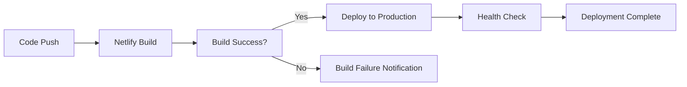

# Deployment Guide

## 🚀 Overview

This guide covers deploying the Novan Webapp to various environments, with a focus on Netlify deployment which is the primary hosting platform for this project.

## 🌍 Environment Configuration

### Environment Variables

Create environment-specific configuration files:

#### Development (`.env.local`)
```env
NEXT_PUBLIC_SUPABASE_URL=your_supabase_dev_url
NEXT_PUBLIC_SUPABASE_ANON_KEY=your_supabase_dev_anon_key
NODE_ENV=development
```

#### Production (`.env.production`)
```env
NEXT_PUBLIC_SUPABASE_URL=your_supabase_prod_url
NEXT_PUBLIC_SUPABASE_ANON_KEY=your_supabase_prod_anon_key
NODE_ENV=production
```

### Supabase Configuration

1. **Create Production Project**
   - Create a new Supabase project for production
   - Configure production database settings
   - Set up production authentication

2. **Apply Migrations**
   ```bash
   # Apply all migrations to production database
   sudo yarn migrate:sync
   ```

3. **Environment Variables**
   - Copy production Supabase URL and anon key
   - Update environment configuration files

## 📦 Build Process

### Local Build Testing

Before deploying, test the build locally:

```bash
# Install dependencies
sudo yarn install

# Build the application
sudo yarn build

# Test production build locally
sudo yarn start
```

### Build Optimization

The build process includes several optimizations:

- **Code Splitting**: Automatic route-based code splitting
- **Tree Shaking**: Removal of unused code
- **Image Optimization**: Next.js automatic image optimization
- **Bundle Analysis**: Analyze bundle size and dependencies

## 🚀 Netlify Deployment

### 1. Repository Setup

1. **Push to Git Repository**
   ```bash
   git add .
   git commit -m "feat: prepare for production deployment"
   git push origin main
   ```

2. **Connect to Netlify**
   - Log in to Netlify dashboard
   - Click "New site from Git"
   - Connect your repository
   - Select the main branch

### 2. Build Configuration

Configure the following build settings in Netlify:

#### Build Settings
- **Build command**: `yarn build`
- **Publish directory**: `.next`
- **Node version**: `18`

#### Environment Variables
Add these environment variables in Netlify:

```env
NEXT_PUBLIC_SUPABASE_URL=your_production_supabase_url
NEXT_PUBLIC_SUPABASE_ANON_KEY=your_production_supabase_anon_key
NODE_ENV=production
```

### 3. Deployment Configuration

#### Netlify Configuration File (`netlify.toml`)

```toml
[build]
  command = "yarn build"
  publish = ".next"

[build.environment]
  NODE_VERSION = "18"
  NPM_FLAGS = "--version"

[[redirects]]
  from = "/*"
  to = "/index.html"
  status = 200

[[headers]]
  for = "/*"
  [headers.values]
    X-Frame-Options = "DENY"
    X-XSS-Protection = "1; mode=block"
    X-Content-Type-Options = "nosniff"
    Referrer-Policy = "strict-origin-when-cross-origin"

[[headers]]
  for = "/_next/static/*"
  [headers.values]
    Cache-Control = "public, max-age=31536000, immutable"

[[headers]]
  for = "/api/*"
  [headers.values]
    Cache-Control = "no-cache"
```

### 4. Domain and SSL

1. **Custom Domain**
   - Add your custom domain in Netlify
   - Configure DNS settings
   - Enable HTTPS with Let's Encrypt

2. **SSL Configuration**
   - Netlify provides automatic SSL certificates
   - Force HTTPS redirects
   - Configure security headers

## 🔄 Continuous Deployment

### Automatic Deployments

1. **Branch Deployments**
   - Main branch: Production deployment
   - Feature branches: Preview deployments
   - Pull requests: Deploy previews

2. **Deploy Triggers**
   - Push to main: Automatic production deployment
   - Pull request: Preview deployment
   - Manual deployment: On-demand deployment

### Deployment Pipeline



## 🧪 Testing Deployment

### Pre-Deployment Checklist

- [ ] All tests pass locally
- [ ] Build completes successfully
- [ ] Environment variables configured
- [ ] Database migrations applied
- [ ] Supabase production configured

### Post-Deployment Verification

1. **Functionality Testing**
   - Test user authentication
   - Verify database connections
   - Check API endpoints
   - Test exercise functionality

2. **Performance Testing**
   - Page load times
   - API response times
   - Database query performance
   - Image loading optimization

3. **Security Testing**
   - Authentication flows
   - Authorization checks
   - Data validation
   - HTTPS enforcement

## 🔍 Monitoring and Analytics

### Performance Monitoring

1. **Core Web Vitals**
   - Largest Contentful Paint (LCP)
   - First Input Delay (FID)
   - Cumulative Layout Shift (CLS)

2. **Application Metrics**
   - Page load times
   - API response times
   - Error rates
   - User engagement

### Error Tracking

1. **Error Monitoring**
   - JavaScript errors
   - API failures
   - Database errors
   - User-reported issues

2. **Logging Strategy**
   - Structured logging
   - Error context
   - Performance metrics
   - User actions

## 🔧 Troubleshooting

### Common Deployment Issues

#### Build Failures
```bash
# Check build logs
netlify logs

# Verify dependencies
yarn install --frozen-lockfile

# Check Node version
node --version
```

#### Environment Variable Issues
- Verify all required variables are set
- Check variable names and values
- Ensure no trailing spaces
- Validate Supabase credentials

#### Database Connection Issues
- Verify Supabase URL and credentials
- Check database permissions
- Ensure migrations are applied
- Test database connectivity

### Rollback Strategy

1. **Quick Rollback**
   - Use Netlify's rollback feature
   - Revert to previous deployment
   - Maintain service availability

2. **Database Rollback**
   - Revert database migrations if needed
   - Restore from backup if necessary
   - Coordinate with frontend changes

## 📊 Performance Optimization

### Build Optimization

1. **Bundle Analysis**
   ```bash
   # Analyze bundle size
   yarn build --analyze
   ```

2. **Code Splitting**
   - Implement dynamic imports
   - Use React.lazy for components
   - Optimize route-based splitting

3. **Image Optimization**
   - Use Next.js Image component
   - Implement proper image formats
   - Optimize image loading

### Runtime Optimization

1. **Caching Strategy**
   - Implement React Query caching
   - Use browser caching
   - Optimize database queries

2. **Performance Monitoring**
   - Monitor Core Web Vitals
   - Track user experience metrics
   - Optimize based on data

## 🔐 Security Considerations

### Production Security

1. **Environment Security**
   - Secure environment variables
   - Restrict access to production
   - Use secure communication channels

2. **Application Security**
   - Enable HTTPS everywhere
   - Implement security headers
   - Regular security audits

3. **Database Security**
   - Row Level Security (RLS)
   - Secure database connections
   - Regular security updates

## 📈 Scaling Considerations

### Performance Scaling

1. **Database Scaling**
   - Optimize database queries
   - Implement proper indexing
   - Use connection pooling

2. **Application Scaling**
   - Implement caching layers
   - Use CDN for static assets
   - Optimize API responses

3. **Infrastructure Scaling**
   - Monitor resource usage
   - Scale based on demand
   - Implement auto-scaling

## 📚 Additional Resources

### Documentation
- [Netlify Documentation](https://docs.netlify.com)
- [Next.js Deployment](https://nextjs.org/docs/deployment)
- [Supabase Production](https://supabase.com/docs/guides/getting-started/tutorials/self-hosting)

### Tools
- [Netlify CLI](https://docs.netlify.com/cli/get-started)
- [Lighthouse CI](https://github.com/GoogleChrome/lighthouse-ci)
- [WebPageTest](https://www.webpagetest.org)

### Best Practices
- [Web Performance](https://web.dev/performance)
- [Security Headers](https://owasp.org/www-project-secure-headers)
- [Progressive Web Apps](https://web.dev/progressive-web-apps)

This deployment guide provides comprehensive information for deploying the Novan Webapp to production environments. Follow these guidelines to ensure successful deployment and optimal performance.


