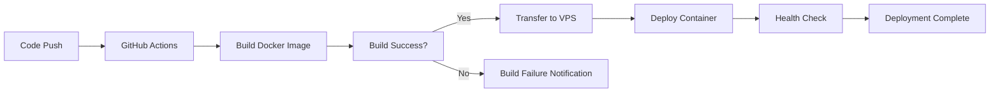

# Deployment Guide

## 🚀 Overview

This guide covers deploying the Novan Webapp using Docker to a VPS (Virtual Private Server), such as Hostinger VPS. The project is fully dockerized and supports automated deployments via GitHub Actions.

For detailed Docker deployment instructions, see [DOCKER_DEPLOYMENT.md](./DOCKER_DEPLOYMENT.md).

## 🌍 Environment Configuration

### Environment Variables

Create environment-specific configuration files:

#### Development (`.env.local`)
```env
NEXT_PUBLIC_SUPABASE_URL=your_supabase_dev_url
NEXT_PUBLIC_SUPABASE_ANON_KEY=your_supabase_dev_anon_key
NEXT_PUBLIC_TURNSTILE_SITE_KEY=your_turnstile_site_key
TURNSTILE_SECRET_KEY=your_turnstile_secret_key
DATABASE_URL=your_database_url
SUPABASE_SERVICE_ROLE_KEY=your_service_role_key
NODE_ENV=development
```

#### Production (`.env.production` or `.env` on VPS)
```env
NEXT_PUBLIC_SUPABASE_URL=your_supabase_prod_url
NEXT_PUBLIC_SUPABASE_ANON_KEY=your_supabase_prod_anon_key
NEXT_PUBLIC_TURNSTILE_SITE_KEY=your_turnstile_site_key
TURNSTILE_SECRET_KEY=your_turnstile_secret_key
DATABASE_URL=your_database_url
SUPABASE_SERVICE_ROLE_KEY=your_service_role_key
NODE_ENV=production
```

### Supabase Configuration

1. **Create Production Project**
   - Create a new Supabase project for production
   - Configure production database settings
   - Set up production authentication

2. **Apply Migrations**
   ```bash
   # Apply all migrations to production database
   sudo yarn migrate:sync
   ```

3. **Environment Variables**
   - Copy production Supabase URL and anon key
   - Update environment configuration files

## 📦 Build Process

### Local Build Testing

Before deploying, test the build locally:

```bash
# Install dependencies
sudo yarn install

# Build the application
sudo yarn build

# Test production build locally
sudo yarn start
```

### Docker Build Testing

Test the Docker build locally:

```bash
# Build Docker image
docker build -t novan-webapp:latest .

# Run container locally
docker run -p 3000:3000 --env-file .env.local novan-webapp:latest
```

### Build Optimization

The build process includes several optimizations:

- **Code Splitting**: Automatic route-based code splitting
- **Tree Shaking**: Removal of unused code
- **Image Optimization**: Next.js automatic image optimization
- **Standalone Output**: Optimized Docker image with minimal dependencies
- **Multi-stage Build**: Reduced final image size

## 🐳 Docker Deployment

### Local Docker Deployment

1. **Build the Image**
   ```bash
   docker build -t novan-webapp:latest .
   ```

2. **Run with Docker Compose**
   ```bash
   docker-compose up -d
   ```

3. **Or Run Directly**
   ```bash
   docker run -d \
     --name novan-webapp \
     --restart unless-stopped \
     -p 3000:3000 \
     --env-file .env \
     novan-webapp:latest
   ```

### VPS Deployment

For detailed VPS deployment instructions, see [DOCKER_DEPLOYMENT.md](./DOCKER_DEPLOYMENT.md).

#### Quick Steps:

1. **Set up VPS**
   - Install Docker and Docker Compose
   - Configure SSH access
   - Set up firewall rules

2. **Configure GitHub Actions**
   - Add required secrets to GitHub repository
   - Configure VPS access credentials

3. **Deploy**
   - Push to `main` branch to trigger automatic deployment
   - Or use manual deployment script

## 🔄 Continuous Deployment

### Automated Deployments (GitHub Actions)

The project includes a GitHub Actions workflow that automatically:

1. **Builds Docker Image**
   - Builds the application
   - Creates optimized Docker image
   - Caches dependencies for faster builds

2. **Deploys to VPS**
   - Transfers image to VPS
   - Stops old container
   - Starts new container
   - Cleans up old images

3. **Deploy Triggers**
   - Push to `main` or `master` branch: Automatic production deployment
   - Push to `staging` branch: Automatic staging deployment (development mode)
   - Manual workflow dispatch: On-demand deployment (choose staging or production)

### Deployment Pipeline



## 🧪 Testing Deployment

### Pre-Deployment Checklist

- [ ] All tests pass locally
- [ ] Build completes successfully
- [ ] Docker build works locally
- [ ] Environment variables configured
- [ ] Database migrations applied
- [ ] Supabase production configured
- [ ] VPS access configured
- [ ] GitHub secrets configured

### Post-Deployment Verification

1. **Functionality Testing**
   - Test user authentication
   - Verify database connections
   - Check API endpoints
   - Test exercise functionality
   - Verify all routes work

2. **Performance Testing**
   - Page load times
   - API response times
   - Database query performance
   - Image loading optimization
   - Container resource usage

3. **Security Testing**
   - Authentication flows
   - Authorization checks
   - Data validation
   - HTTPS enforcement (if using reverse proxy)
   - Environment variable security

## 🔍 Monitoring and Analytics

### Container Monitoring

1. **Check Container Status**
   ```bash
   docker ps
   docker logs novan-webapp
   docker stats novan-webapp
   ```

2. **Health Checks**
   - Container health status
   - Application responsiveness
   - Resource usage
   - Error logs

### Performance Monitoring

1. **Core Web Vitals**
   - Largest Contentful Paint (LCP)
   - First Input Delay (FID)
   - Cumulative Layout Shift (CLS)

2. **Application Metrics**
   - Page load times
   - API response times
   - Error rates
   - User engagement

### Error Tracking

1. **Error Monitoring**
   - JavaScript errors
   - API failures
   - Database errors
   - User-reported issues

2. **Logging Strategy**
   - Structured logging
   - Error context
   - Performance metrics
   - User actions

## 🔧 Troubleshooting

### Common Deployment Issues

#### Build Failures
```bash
# Check build logs
docker build -t novan-webapp:latest . --progress=plain

# Verify dependencies
yarn install --frozen-lockfile

# Check Node version
node --version
```

#### Container Won't Start
```bash
# Check logs
docker logs novan-webapp

# Check container status
docker ps -a

# Verify environment variables
docker exec novan-webapp env
```

#### Environment Variable Issues
- Verify all required variables are set
- Check variable names and values
- Ensure no trailing spaces
- Validate Supabase credentials
- Check `.env` file format

#### Database Connection Issues
- Verify Supabase URL and credentials
- Check database permissions
- Ensure migrations are applied
- Test database connectivity
- Check network connectivity from container

#### Port Already in Use
```bash
# Find process using port 3000
sudo lsof -i :3000

# Kill process or change port
docker run -p 3001:3000 novan-webapp:latest
```

### Rollback Strategy

1. **Quick Rollback**
   ```bash
   # Stop current container
   docker stop novan-webapp
   
   # Tag old image as latest
   docker tag novan-webapp:old novan-webapp:latest
   
   # Start container with old image
   docker run -d \
     --name novan-webapp \
     --restart unless-stopped \
     -p 3000:3000 \
     --env-file .env \
     novan-webapp:latest
   ```

2. **Database Rollback**
   - Revert database migrations if needed
   - Restore from backup if necessary
   - Coordinate with frontend changes

3. **Git Rollback**
   ```bash
   git revert <commit-hash>
   git push origin main
   ```

## 📊 Performance Optimization

### Build Optimization

1. **Docker Layer Caching**
   - Optimize Dockerfile layer order
   - Use multi-stage builds
   - Cache dependencies

2. **Bundle Analysis**
   - Analyze bundle size
   - Identify large dependencies
   - Optimize imports

3. **Code Splitting**
   - Implement dynamic imports
   - Use React.lazy for components
   - Optimize route-based splitting

4. **Image Optimization**
   - Use Next.js Image component
   - Implement proper image formats
   - Optimize image loading

### Runtime Optimization

1. **Caching Strategy**
   - Implement React Query caching
   - Use browser caching
   - Optimize database queries
   - Configure reverse proxy caching

2. **Resource Management**
   - Monitor container resource usage
   - Set appropriate memory limits
   - Optimize CPU usage
   - Configure auto-restart policies

3. **Performance Monitoring**
   - Monitor Core Web Vitals
   - Track user experience metrics
   - Optimize based on data
   - Set up alerts

## 🔐 Security Considerations

### Production Security

1. **Environment Security**
   - Secure environment variables
   - Use secrets management
   - Restrict access to production
   - Use secure communication channels
   - Never commit `.env` files

2. **Application Security**
   - Enable HTTPS everywhere
   - Implement security headers (via reverse proxy)
   - Regular security audits
   - Keep dependencies updated
   - Use non-root user in container

3. **Database Security**
   - Row Level Security (RLS)
   - Secure database connections
   - Regular security updates
   - Use strong credentials
   - Limit database access

4. **Container Security**
   - Use minimal base images
   - Keep images updated
   - Scan for vulnerabilities
   - Use non-root user
   - Limit container capabilities

5. **VPS Security**
   - Keep system updated
   - Configure firewall
   - Use SSH keys instead of passwords
   - Set up fail2ban
   - Regular security audits

## 📈 Scaling Considerations

### Performance Scaling

1. **Database Scaling**
   - Optimize database queries
   - Implement proper indexing
   - Use connection pooling
   - Consider read replicas

2. **Application Scaling**
   - Implement caching layers
   - Use CDN for static assets
   - Optimize API responses
   - Load balancing (multiple containers)

3. **Infrastructure Scaling**
   - Monitor resource usage
   - Scale based on demand
   - Use Docker Swarm or Kubernetes for orchestration
   - Implement auto-scaling

### Horizontal Scaling

To scale horizontally:

```bash
# Run multiple containers with load balancer
docker run -d --name novan-webapp-1 -p 3001:3000 --env-file .env novan-webapp:latest
docker run -d --name novan-webapp-2 -p 3002:3000 --env-file .env novan-webapp:latest

# Configure Nginx as load balancer
# (See DOCKER_DEPLOYMENT.md for Nginx configuration)
```

## 📚 Additional Resources

### Documentation
- [Docker Documentation](https://docs.docker.com/)
- [Next.js Deployment](https://nextjs.org/docs/deployment)
- [Supabase Production](https://supabase.com/docs/guides/getting-started/tutorials/self-hosting)
- [Docker Deployment Guide](./DOCKER_DEPLOYMENT.md)

### Tools
- [Docker Compose](https://docs.docker.com/compose/)
- [GitHub Actions](https://docs.github.com/en/actions)
- [Lighthouse CI](https://github.com/GoogleChrome/lighthouse-ci)
- [WebPageTest](https://www.webpagetest.org)

### Best Practices
- [Web Performance](https://web.dev/performance)
- [Security Headers](https://owasp.org/www-project-secure-headers)
- [Docker Best Practices](https://docs.docker.com/develop/dev-best-practices/)
- [Progressive Web Apps](https://web.dev/progressive-web-apps)

This deployment guide provides comprehensive information for deploying the Novan Webapp to production environments using Docker. Follow these guidelines to ensure successful deployment and optimal performance.
